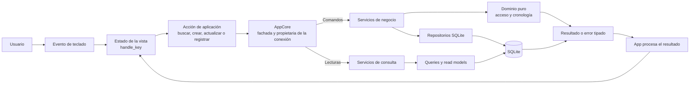
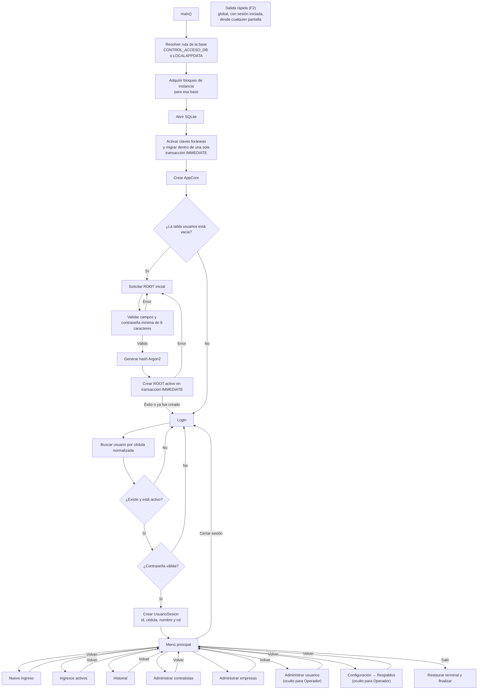
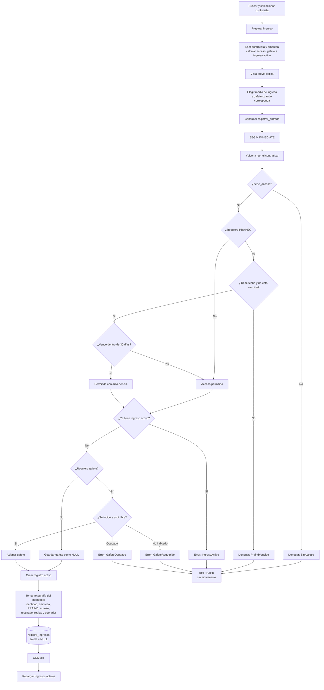
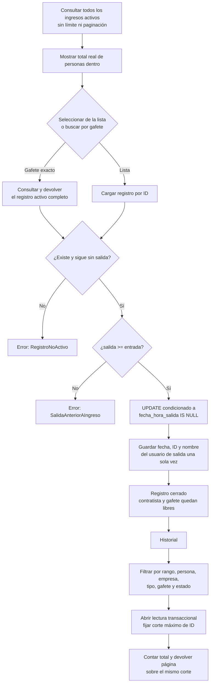
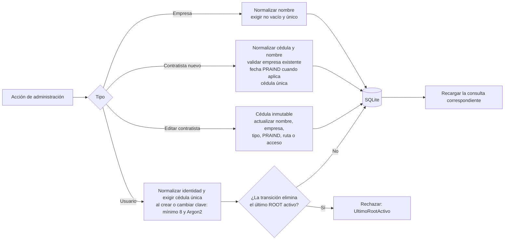
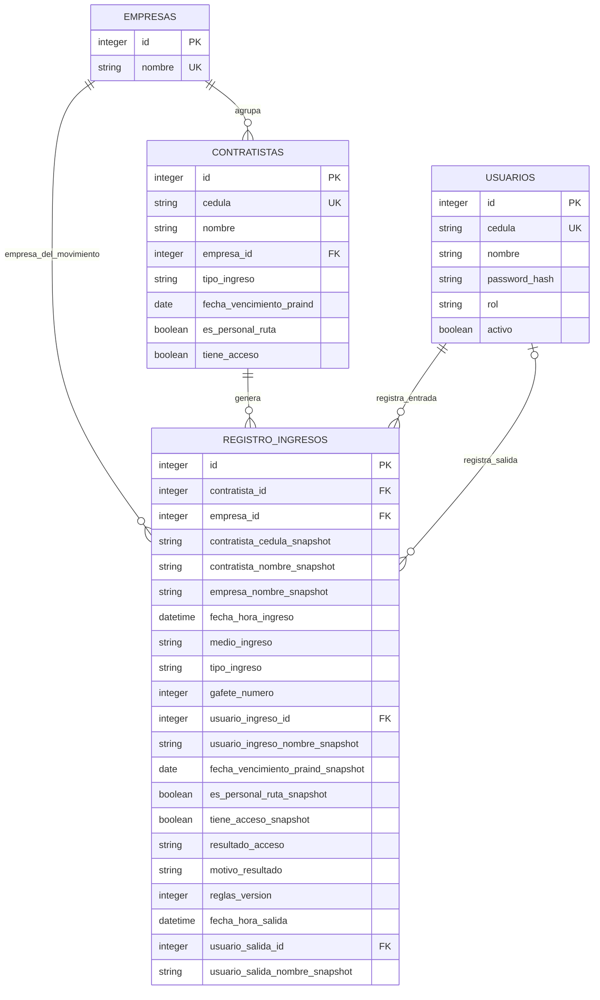
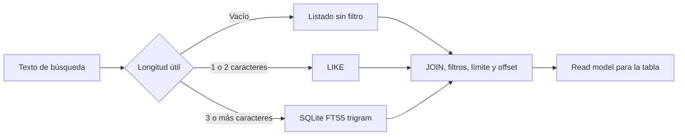

# Diagrama lógico de Control de Acceso

Este documento describe el funcionamiento interno de la aplicación. Omite el dibujo de
pantallas, colores y distribución visual de la TUI.

## 1. Flujo general



El patrón de cada operación es:

```text
tecla → State.handle_key() → Accion* → App → AppCore
      → servicio/query → repositorio/SQLite → Result
      → State.completar_*() → nuevo estado
```

- Los estados de la TUI no ejecutan SQL.
- `AppCore` conserva la única conexión y compone servicios, repositorios y consultas para
  cada caso de uso; no contiene reglas de negocio.
- Las llamadas son directas, síncronas y ocurren en el mismo bucle de eventos.

## 2. Arranque, configuración y sesión



El inicio ROOT es atómico: dos instancias no pueden crear simultáneamente dos usuarios
iniciales. La autenticación nunca devuelve el `password_hash` dentro de la sesión.

**Salida rápida (F2):** overlay global que registra la salida de un ingreso activo por
gafete o por nombre/cédula sin navegar hasta Ingresos activos, alcanzable con sesión
iniciada desde cualquier pantalla (`src/tui/salida_rapida/`).

**Configuración → Respaldos:** entrada 7 del menú (visible sólo para ROOT y
Administrador) con Crear, Listar, Revalidar, Exportar y Restaurar respaldos —
ver [plan de respaldos](plan-respaldos.md).

## 3. Registro de una entrada

La preparación muestra el estado actual, pero no reserva recursos ni funciona como una
autorización guardada. Al confirmar, la aplicación adquiere una transacción `IMMEDIATE`;
el servicio vuelve a leer, validar e insertar usando exclusivamente esa transacción.



El bloqueo de escritura sólo existe durante la confirmación final; nunca permanece
abierto mientras el operador busca, revisa o completa el formulario. Si otra escritura
termina primero, la transacción espera y después vuelve a leer el estado ya actualizado.

Reglas para PRAIND y gafete:

| Condición del contratista | Requiere PRAIND | Requiere gafete |
|---|---:|---:|
| Tipo `PRAIND` | Sí | Sí |
| Tipo `IN_HOUSE` | Sí | No |
| Tipo `POR_CORREO` | No | Sí |
| Tipo `SWAT` | No | No |
| Personal de ruta, sin importar el tipo | Sí | No |

Si un contratista no requiere gafete, cualquier número recibido se descarta y se guarda
`NULL`. La base refuerza que solo exista un ingreso activo por contratista y un único uso
activo de cada gafete.

## 4. Registro de salida e historial



El intervalo del historial es `[desde, hasta)`: incluye `desde`, excluye `hasta` y exige
que `desde < hasta`.

La lista operativa de ingresos activos no se pagina ni tiene un tope silencioso. Un
filtro puede reducir las filas visibles, pero conserva el total real de personas dentro.
La búsqueda exacta por gafete consulta el registro completo directamente y no depende de
que esté presente en las filas filtradas.

El total y las filas del historial se consultan dentro de una misma transacción de
lectura. La primera página fija el ID máximo visible y las páginas siguientes conservan
ese corte; por eso un ingreso nuevo no desplaza filas, no produce duplicados y sólo
aparece al iniciar una navegación nueva.

La política temporal es única para toda la aplicación:

```text
reloj del sistema → instante UTC → reglas de calendario en America/Costa_Rica
                                → SQLite: YYYY-MM-DDTHH:MM:SSZ
                                → TUI: fecha y hora de Costa Rica
```

`AppCore` toma la hora de entradas y salidas; la TUI ya no entrega fechas obtenidas de la
zona configurada en Windows. Los filtros escritos como fechas de Costa Rica se convierten
a límites UTC antes de consultar. La migración convierte los movimientos anteriores,
que representaban hora local costarricense, y SQLite rechaza nuevos formatos sin zona.
Antes de cada movimiento se compara el reloj con el último instante persistido; un
retroceso detiene la operación y solicita corregir la fecha y hora del equipo.

No existe una segunda tabla de historial ni se mueve físicamente el registro. El mismo
movimiento nace activo con `fecha_hora_salida = NULL`; al registrar la salida se completa
esa misma fila y pasa a verse como cerrado. Desde el ingreso se guardan copias de los
datos que explican quién entró y bajo qué condiciones:

- cédula y nombre del contratista;
- nombre de la empresa y tipo de ingreso;
- PRAIND, condición de personal de ruta y estado de acceso evaluados;
- resultado (`PERMITIDO` o `PERMITIDO_CON_ADVERTENCIA`), motivo y versión de reglas;
- nombre de los operadores de entrada y salida.

Los identificadores originales se conservan como referencias, pero el historial se
muestra y se busca usando esas copias. Por eso renombrar al contratista, cambiarlo de
empresa o renombrar a un operador no reescribe el pasado. SQLite impide modificar los
datos de entrada, registrar dos salidas o eliminar movimientos. Los movimientos creados
antes de esta mejora se copian con los datos disponibles al migrar y se identifican como
`MIGRADO / DATOS_RECONSTRUIDOS`; no se presentan como una fotografía exacta que nunca
existió.

## 5. Administración de datos



Los usuarios se activan o desactivan; no se eliminan, porque sus identificadores forman
parte de la auditoría de entradas y salidas.

## 6. Relaciones persistidas



Las columnas marcadas conceptualmente como `snapshot` son copias históricas; en SQLite
sus nombres no llevan ese sufijo. Los IDs mantienen integridad referencial y las copias
mantienen el significado histórico del evento.

## 7. Lecturas y búsqueda

Las lecturas usan consultas especializadas y modelos sin campos sensibles:



FTS5 se usa para contratistas, empresas y usuarios; sus tablas se sincronizan mediante
triggers. Las búsquedas de usuarios nunca exponen el hash de contraseña.

## Observaciones de la implementación actual

- `Root`, `Administrador` y `Operador` se persisten y se muestran en la sesión.
  `Usuarios` y `Configuración` ya están ocultas del menú (y de sus atajos de teclado) para
  `Operador` (`OpcionMenu::visibles_para`, `src/tui/menu_principal/state.rs`). Fuera de esa
  visibilidad de menú, `Root` y `Administrador` siguen siendo funcionalmente idénticos —
  no hay ninguna otra operación que distinga entre ambos salvo la protección de no poder
  desactivar/degradar al último `Root` activo.
- La preparación del ingreso es informativa: la autorización definitiva ocurre de nuevo
  al registrar la entrada.
- El historial conserva el resultado evaluado al ingresar. La lista operativa de activos
  también recalcula el acceso actual para advertir si una autorización fue revocada
  mientras la persona todavía está dentro, sin modificar la fotografía histórica.
- Las fechas se guardan como instantes UTC canónicos y se presentan en
  `America/Costa_Rica`; no dependen de la zona horaria configurada en el equipo.

## Archivos que implementan el flujo

- Arranque y fachada: `src/main.rs`, `src/application.rs`.
- Máquina de estados: `src/tui/app.rs` y los archivos `src/tui/*/state.rs`.
- Casos de uso: `src/services/`.
- Reglas puras: `src/domain/acceso.rs`, `src/domain/registro_ingreso.rs`.
- Política temporal y reloj: `src/tiempo.rs`.
- Entidades: `src/models/`.
- Persistencia, consultas y migraciones: `src/database/`.
