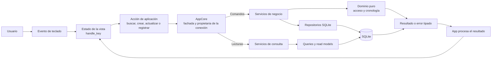
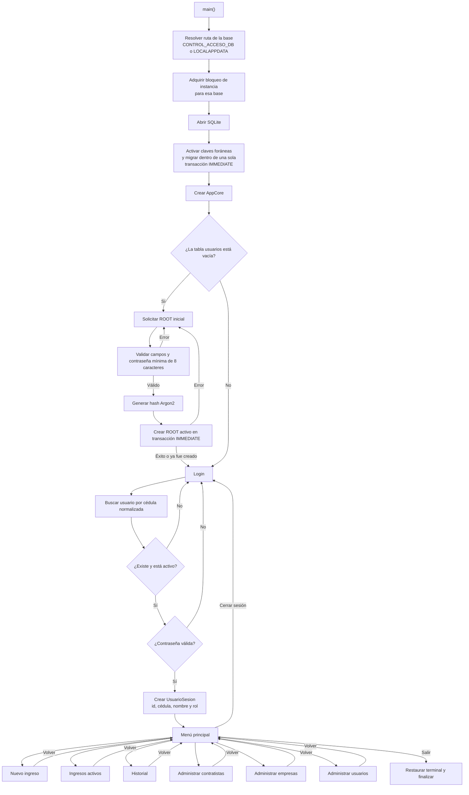
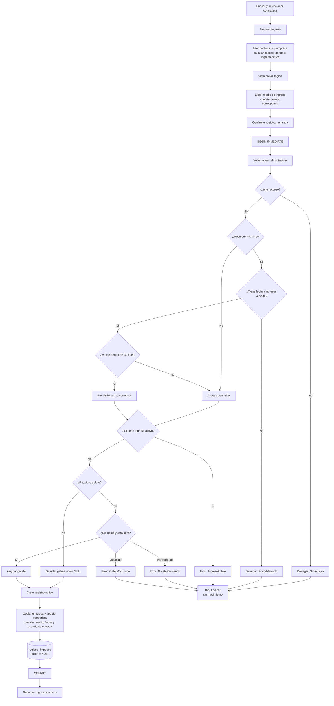
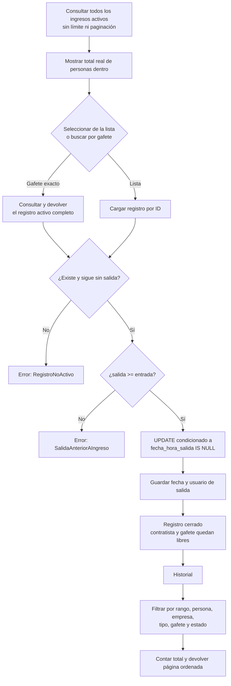
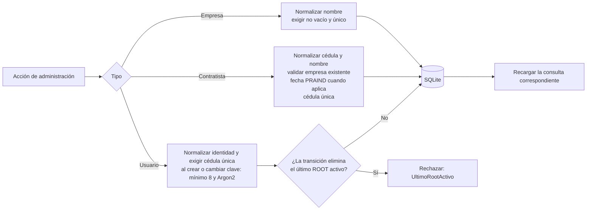
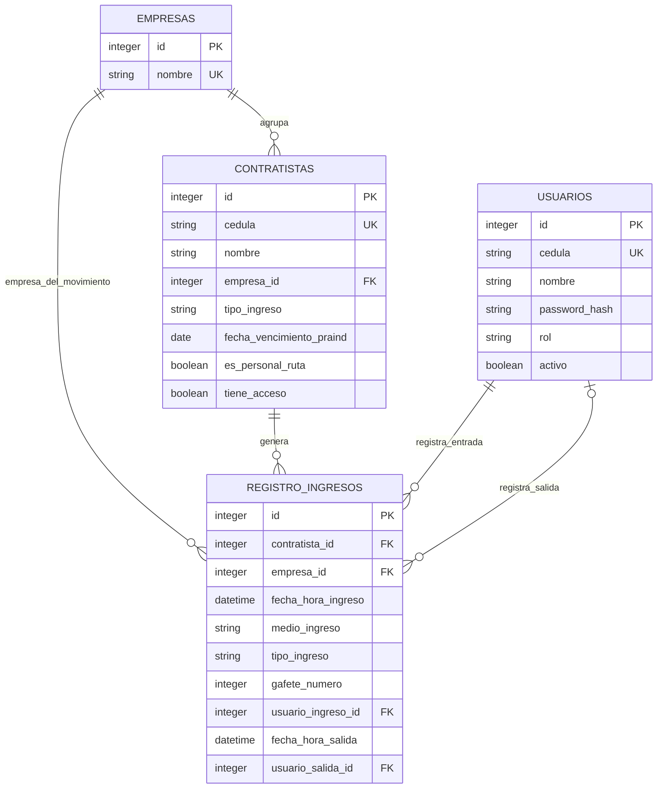
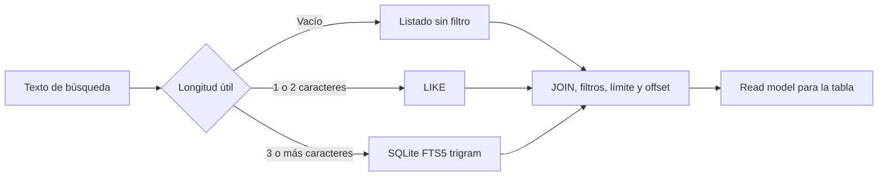

# Diagrama lógico de Control de Acceso

Este documento describe el funcionamiento interno de la aplicación. Omite el dibujo de
pantallas, colores y distribución visual de la TUI.

## 1. Flujo general



El patrón de cada operación es:

```text
tecla → State.handle_key() → Accion* → App → AppCore
      → servicio/query → repositorio/SQLite → Result
      → State.completar_*() → nuevo estado
```

- Los estados de la TUI no ejecutan SQL.
- `AppCore` conserva la única conexión y compone servicios, repositorios y consultas para
  cada caso de uso; no contiene reglas de negocio.
- Las llamadas son directas, síncronas y ocurren en el mismo bucle de eventos.

## 2. Arranque, configuración y sesión



El inicio ROOT es atómico: dos instancias no pueden crear simultáneamente dos usuarios
iniciales. La autenticación nunca devuelve el `password_hash` dentro de la sesión.

## 3. Registro de una entrada

La preparación muestra el estado actual, pero no reserva recursos ni funciona como una
autorización guardada. Al confirmar, la aplicación adquiere una transacción `IMMEDIATE`;
el servicio vuelve a leer, validar e insertar usando exclusivamente esa transacción.



El bloqueo de escritura sólo existe durante la confirmación final; nunca permanece
abierto mientras el operador busca, revisa o completa el formulario. Si otra escritura
termina primero, la transacción espera y después vuelve a leer el estado ya actualizado.

Reglas para PRAIND y gafete:

| Condición del contratista | Requiere PRAIND | Requiere gafete |
|---|---:|---:|
| Tipo `PRAIND` | Sí | Sí |
| Tipo `IN_HOUSE` | Sí | No |
| Tipo `POR_CORREO` | No | Sí |
| Tipo `SWAT` | No | No |
| Personal de ruta, sin importar el tipo | Sí | No |

Si un contratista no requiere gafete, cualquier número recibido se descarta y se guarda
`NULL`. La base refuerza que solo exista un ingreso activo por contratista y un único uso
activo de cada gafete.

## 4. Registro de salida e historial



El intervalo del historial es `[desde, hasta)`: incluye `desde`, excluye `hasta` y exige
que `desde < hasta`.

La lista operativa de ingresos activos no se pagina ni tiene un tope silencioso. Un
filtro puede reducir las filas visibles, pero conserva el total real de personas dentro.
La búsqueda exacta por gafete consulta el registro completo directamente y no depende de
que esté presente en las filas filtradas.

## 5. Administración de datos



Los usuarios se activan o desactivan; no se eliminan, porque sus identificadores forman
parte de la auditoría de entradas y salidas.

## 6. Relaciones persistidas



`registro_ingresos` copia `empresa_id` y `tipo_ingreso` al momento de la entrada. Así, el
movimiento conserva esos valores aunque después cambie el contratista.

## 7. Lecturas y búsqueda

Las lecturas usan consultas especializadas y modelos sin campos sensibles:



FTS5 se usa para contratistas, empresas y usuarios; sus tablas se sincronizan mediante
triggers. Las búsquedas de usuarios nunca exponen el hash de contraseña.

## Observaciones de la implementación actual

- `Root`, `Administrador` y `Operador` se persisten y se muestran en la sesión, pero no
  existe todavía una comprobación de rol al abrir o ejecutar los casos de uso de
  administración. Actualmente, cualquier usuario autenticado alcanza esas operaciones.
- La preparación del ingreso es informativa: la autorización definitiva ocurre de nuevo
  al registrar la entrada.
- El resultado `Permitido` o `PermitidoConAdvertencia` no se guarda en el movimiento. En
  la lista de activos se recalcula con los datos actuales del contratista.
- Las fechas representan hora local y se guardan como texto `YYYY-MM-DD HH:MM:SS`; no son
  UTC.

## Archivos que implementan el flujo

- Arranque y fachada: `src/main.rs`, `src/application.rs`.
- Máquina de estados: `src/tui/app.rs` y los archivos `src/tui/*/state.rs`.
- Casos de uso: `src/services/`.
- Reglas puras: `src/domain/acceso.rs`, `src/domain/registro_ingreso.rs`.
- Entidades: `src/models/`.
- Persistencia, consultas y migraciones: `src/database/`.
