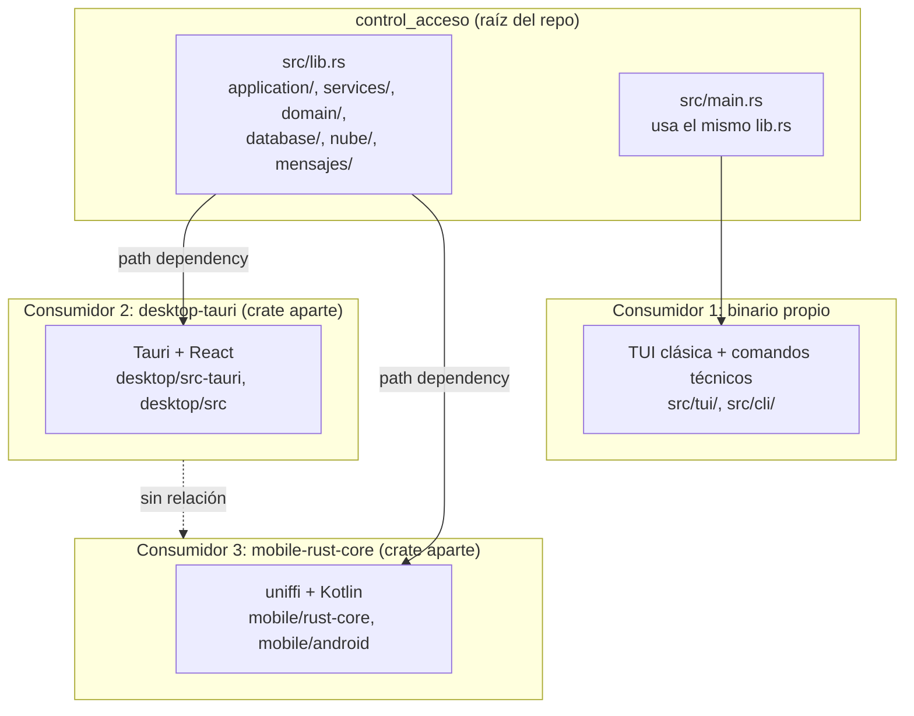
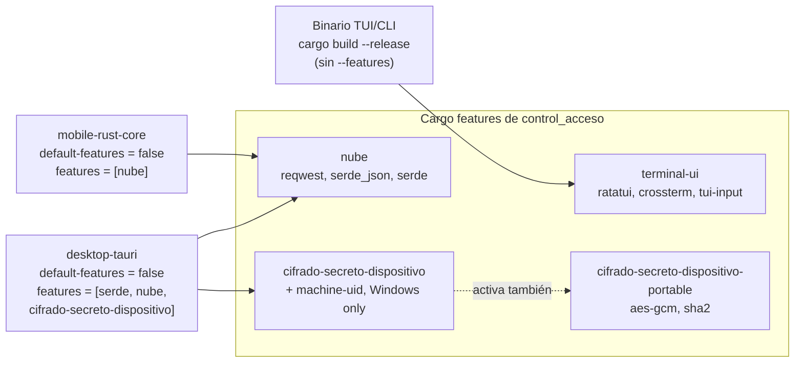
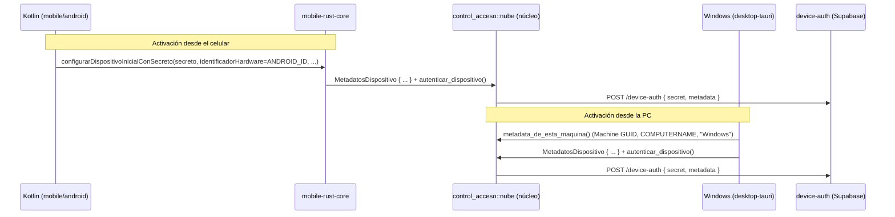

# Núcleo compartido y sus consumidores

Este documento responde una pregunta distinta a la de
[`diagramas-arquitectura.md`](diagramas-arquitectura.md): no "cómo fluye una acción
dentro de la GUI", sino **quién depende de quién a nivel de crates de Rust**, y por qué
esa separación importa. Nace de una duda concreta (2026-09-08): al agregar metadata de
dispositivo compartida entre escritorio y móvil, ¿escritorio terminó dependiendo de
móvil? La respuesta corta es no, y este documento es el porqué con diagramas.

## 1. Un solo crate, tres formas de consumirlo

`control_acceso` (la raíz del repo, `Cargo.toml` + `src/`) es un único paquete de Rust
que se compila de tres maneras distintas, para tres consumidores que **no se conocen
entre sí**:

La flecha punteada de abajo es la que importa: **no existe**. `desktop-tauri` y
`mobile-rust-core` son dos crates de Cargo separados, cada uno con su propio
`Cargo.toml`, que declaran a `control_acceso` como `path dependency` — igual que dos
apps distintas que comparten una librería. Ninguno de los dos aparece en el
`Cargo.toml` del otro, y no hay forma de que uno importe código del otro sin pasar
primero por el núcleo compartido.

El binario de TUI/CLI (`src/main.rs`) es un caso distinto todavía: no es un crate
aparte, es **el mismo paquete** compilado como ejecutable en vez de como librería
(Cargo permite ambos a la vez cuando existen `src/lib.rs` y `src/main.rs`). Por eso no
hace falta ninguna dependencia para que la TUI use el núcleo — ya es el núcleo.

## 2. Qué feature flags activa cada consumidor

El núcleo no se compila igual para los tres. Cada consumidor prende sólo lo que
necesita vía Cargo features (ver `[features]` en el `Cargo.toml` de la raíz):

Tres consecuencias directas de esto, verificadas contra el código (no supuestas):

- **El binario TUI/CLI que se distribuye no incluye `nube`.** Ni `cargo build
  --release` (CI) ni `cargo build-native` pasan `--features nube` — es una herramienta
  local pura, sin sincronización a la nube. Si algún día eso cambia, es una decisión de
  producto explícita, no un descuido.
- **Sólo escritorio cifra el secreto con el Machine GUID de Windows** (feature
  `cifrado-secreto-dispositivo`, que depende de `machine-uid`, un crate que ni siquiera
  se compila para Android). Móvil activa `nube` nada más — cifra su copia del secreto
  del lado de Kotlin (Android Keystore), no en este crate.
- **Agregar una dependencia nueva a una feature no afecta a quien no la activa.** Si
  mañana `cifrado-secreto-dispositivo` sumara otro crate de Windows, `mobile-rust-core`
  seguiría compilando exactamente igual — nunca pidió esa feature.

## 3. Ejemplo real: metadata de dispositivo (2026-09-08)

Este es el caso concreto que motivó el documento. `MetadatosDispositivo` (un `struct`
con campos neutrales: `identificador_hardware`, `nombre_dispositivo`, `plataforma`,
`version_build`, `app_version`) vive en `src/nube/cliente.rs` — en el núcleo, no en
ninguno de los dos consumidores — porque la función que de verdad manda esos datos por
HTTP (`autenticar_dispositivo`) también vive ahí, una sola vez.

Cada plataforma arma su propio valor para el mismo `struct` (Kotlin lee
`Settings.Secure.ANDROID_ID`; Rust de escritorio lee el Machine GUID vía
`machine_uid::get()`, sólo disponible ahí por la feature `cifrado-secreto-dispositivo`)
y se lo pasa a la **misma** función compartida. Ninguna plataforma reimplementa el
cliente HTTP ni conoce cómo la otra arma sus datos.

**La regla que hay que preservar:** si algo nuevo necesita vivir en un tipo compartido
para que ambos consumidores lo usen sin duplicar lógica, ese tipo va en el núcleo
(`src/`), nunca dentro de `mobile/rust-core` ni de `desktop/src-tauri` — eso es
justamente lo que crearía la dependencia cruzada que no debe existir.

## Archivos guía

- Núcleo compartido: `Cargo.toml` (raíz), `src/lib.rs`, `src/nube/`.
- Consumidor TUI/CLI: `src/main.rs`, `src/tui/`, `src/cli/`.
- Consumidor escritorio: `desktop/src-tauri/Cargo.toml`, `desktop/src-tauri/src/comandos/`.
- Consumidor móvil: `mobile/rust-core/Cargo.toml`, `mobile/rust-core/src/lib.rs`.
- Flujo interno de una acción (dentro del núcleo): `docs/diagramas-arquitectura.md`,
  sección 5.
- Plan de sesión única y metadata de dispositivo:
  `docs/plan-sesion-unica-dispositivos.md`.
