# Diagramas de arquitectura y operación

Este documento reúne vistas complementarias de Control de Acceso. La idea no es tener
un único diagrama gigante, sino varias lecturas: qué ve el operador, cómo viajan las
acciones, dónde viven las reglas y qué queda persistido.

## 1. Mapa general

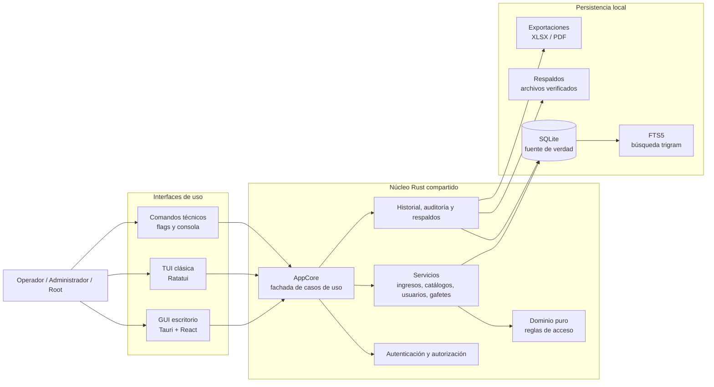

Todas las interfaces llegan al mismo núcleo. La GUI no reimplementa reglas; la TUI y la
GUI comparten `AppCore`, servicios, repositorios, consultas, validación temporal y
mensajes de error de negocio.

## 2. Capas de ejecución

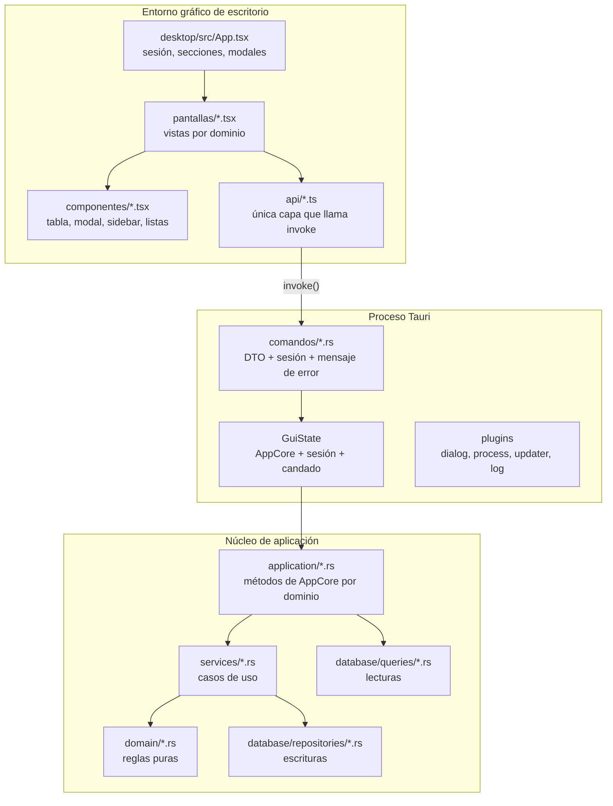

La separación importante es que `pantallas/*.tsx` no invoca Tauri directamente. Cada
dominio tiene su cliente en `api/*.ts`, y cada comando Tauri es una función fina que
obtiene la sesión, llama a `AppCore` y traduce el error al mensaje de usuario.

## 3. Navegación GUI

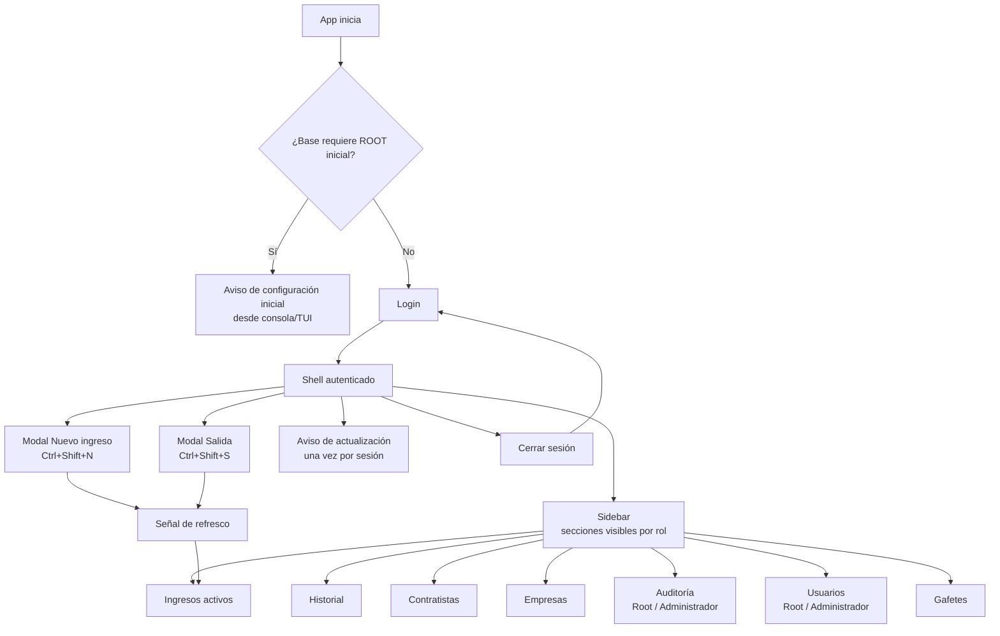

La GUI está organizada como una consola de trabajo: `Shell` mantiene sesión, sidebar,
sección activa, modales globales y refresco de ingresos activos. Cada pantalla conserva
su propio estado de filtros, tablas y formularios.

## 4. Navegación TUI

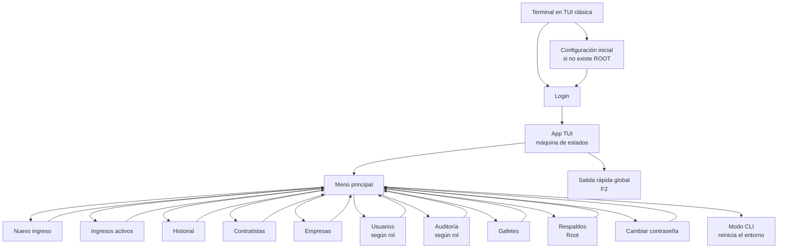

La TUI usa estados por pantalla (`src/tui/*/state.rs`) y renderizadores por pantalla
(`src/tui/*/render.rs`). Los estados producen acciones de aplicación; el núcleo ejecuta
la operación y luego el estado recibe el resultado para refrescar la vista.

## 5. Ciclo de una acción

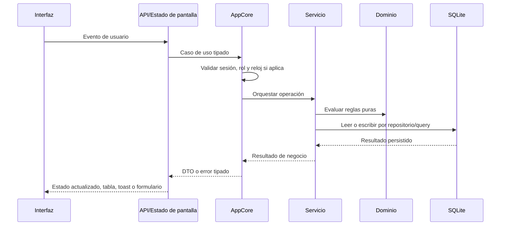

Las reglas de negocio no viven en el render visual. La interfaz solicita una acción; el
núcleo decide si el actor puede ejecutarla y si el estado actual de SQLite permite
completarla.

## 6. Registro de ingreso

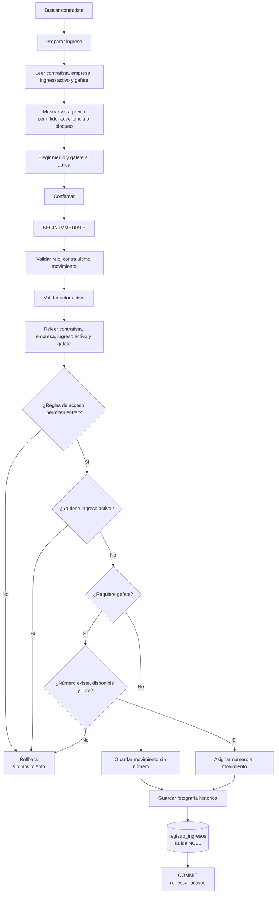

La preparación es informativa. La autorización real ocurre de nuevo en la confirmación,
dentro de la transacción de escritura, para evitar decisiones basadas en datos que ya
cambiaron.

## 7. Registro de salida

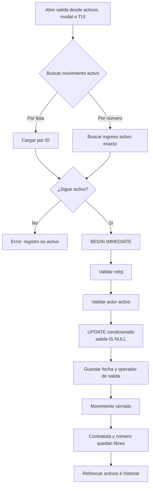

La fila no se mueve a otra tabla. El historial aparece cuando se completa
`fecha_hora_salida` en el mismo movimiento creado al ingresar.

## 8. Gafetes físicos

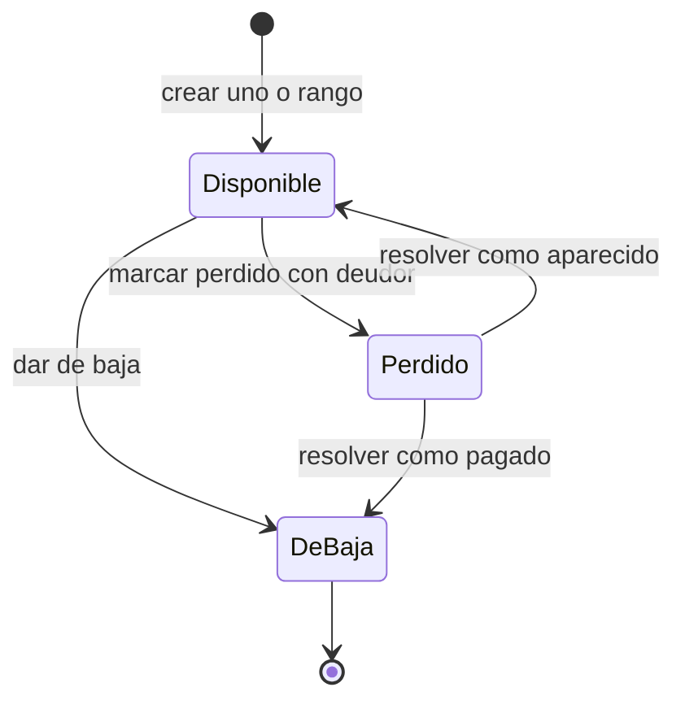

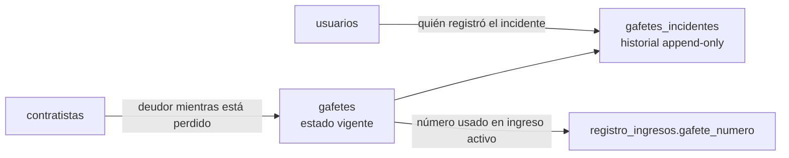

El catálogo de gafetes físicos guarda el estado actual del número. Los incidentes
guardan cuándo se reportó o resolvió un problema y quién lo hizo. Los movimientos
históricos conservan el número usado, aunque el catálogo actual cambie después.

## 9. Autorización por rol

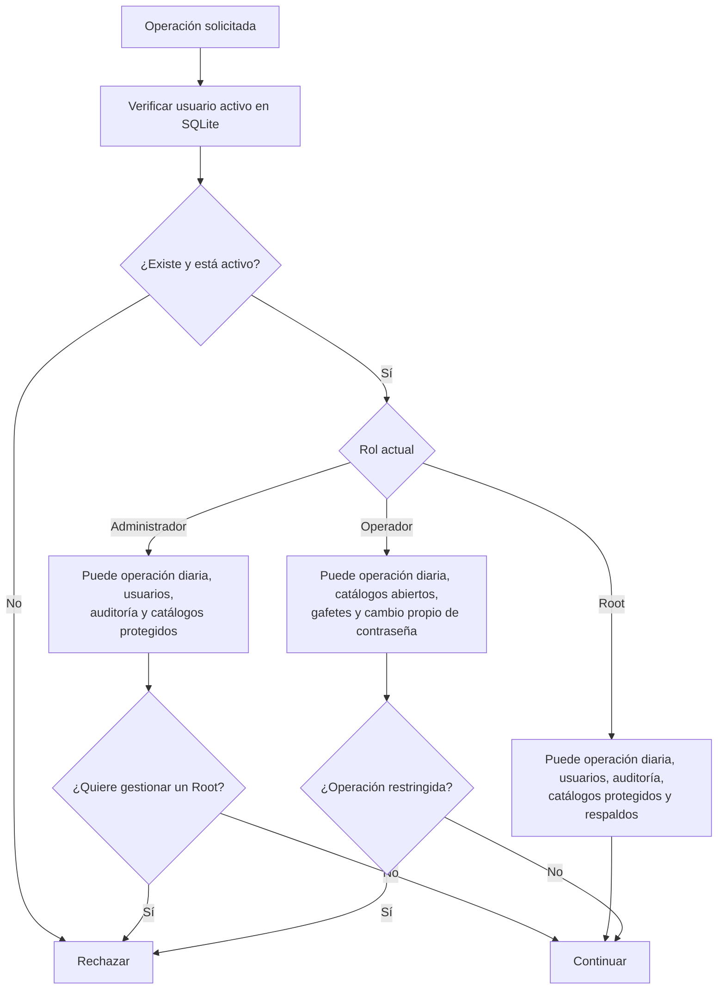

El rol guardado en la sesión es una fotografía para la interfaz. Para operaciones
sensibles, `AppCore` consulta el usuario vigente en SQLite; si alguien fue desactivado o
degradado, el cambio aplica en la siguiente operación.

## 10. Datos persistidos

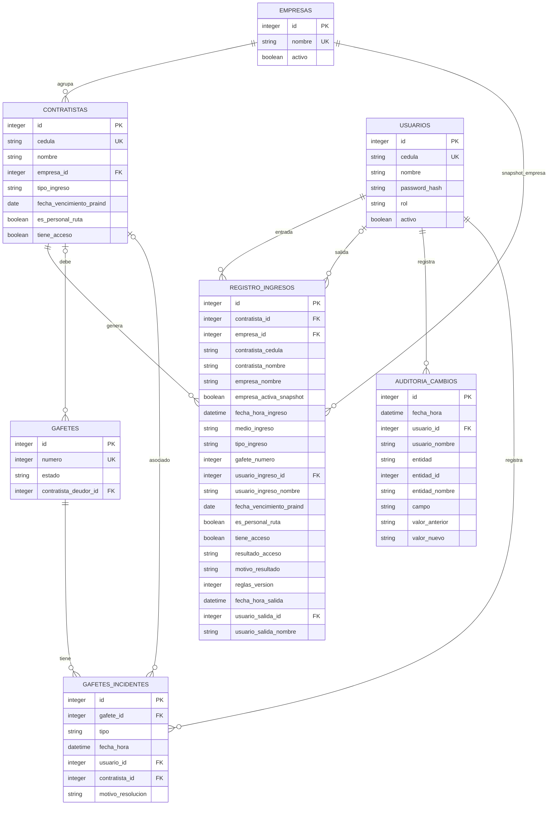

`registro_ingresos` mezcla referencias vivas con copias históricas. Las referencias
mantienen integridad; las copias explican el movimiento como ocurrió en ese momento,
aunque después cambien nombres, empresas, roles o estados.

## 11. Búsqueda, historial y exportación

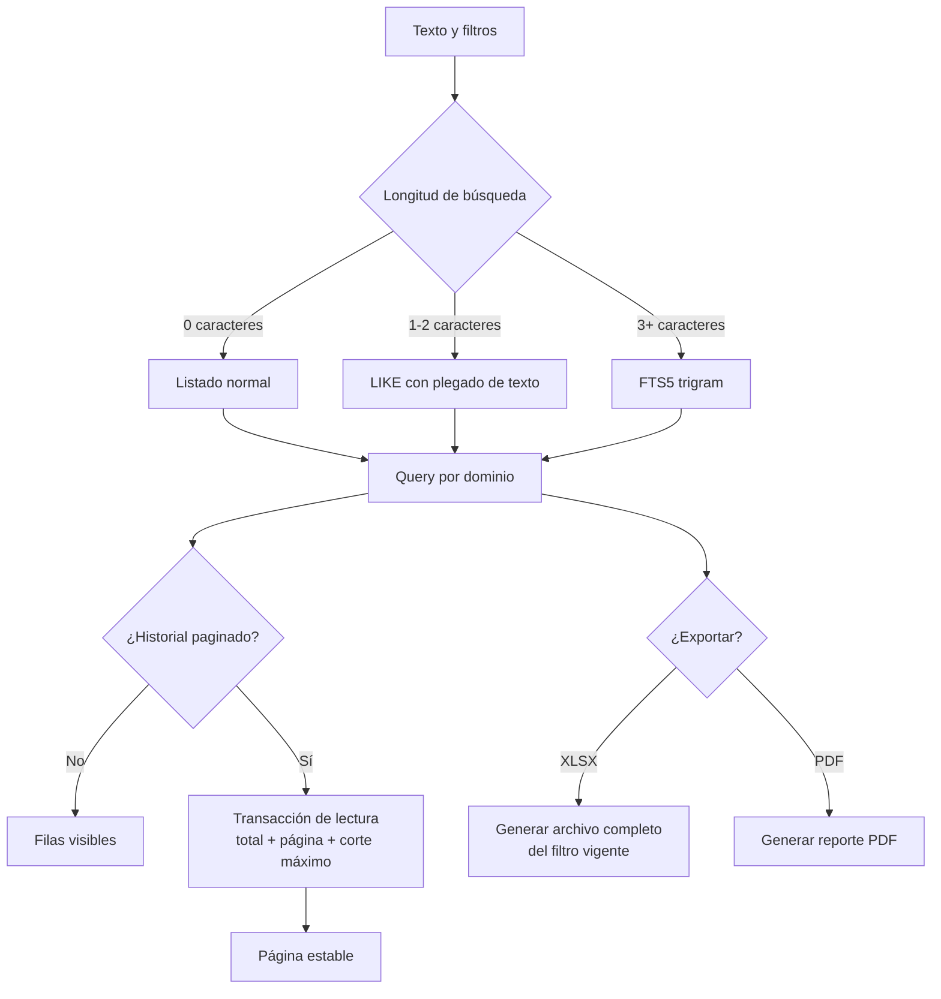

El historial usa un corte estable para que los movimientos nuevos no desplacen páginas
ya abiertas. La exportación toma el filtro completo, no sólo la página visible.

## 12. Arranque, base y respaldos

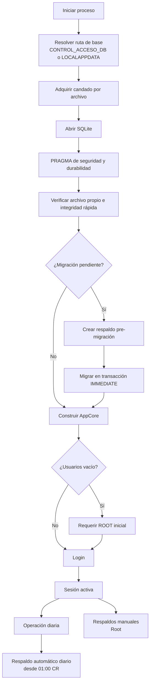

La base local es la fuente de verdad. Las migraciones son secuenciales con
`PRAGMA user_version`, y los respaldos se validan antes de considerarse confiables.

## Archivos guía

- GUI: `desktop/src/App.tsx`, `desktop/src/pantallas/`, `desktop/src/api/`.
- Puente Tauri: `desktop/src-tauri/src/lib.rs`, `desktop/src-tauri/src/comandos/`.
- Núcleo: `src/application/`, `src/services/`, `src/domain/`.
- Persistencia: `src/database/schema.rs`, `src/database/repositories/`, `src/database/queries/`.
- TUI: `src/tui/`.
- Diagrama lógico detallado: `docs/diagrama-logico.md`.
