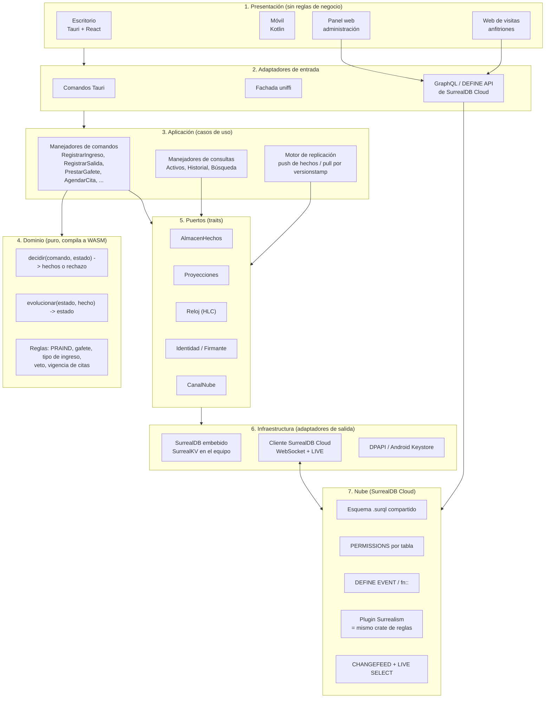
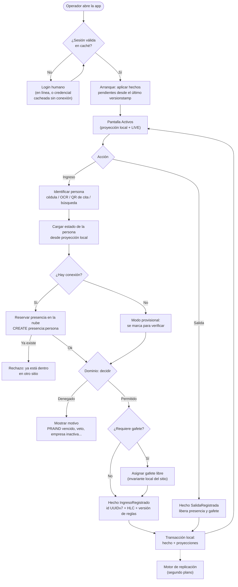
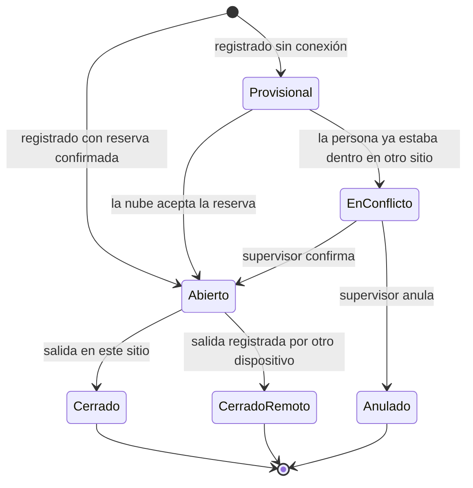
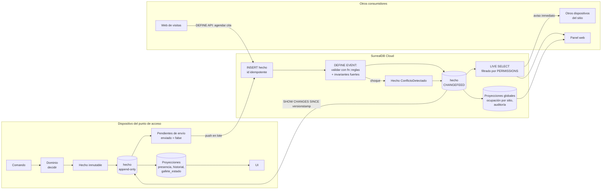
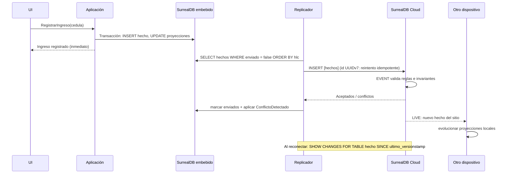
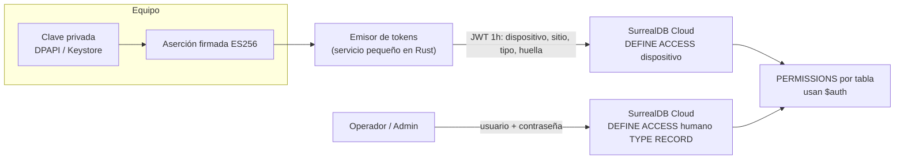
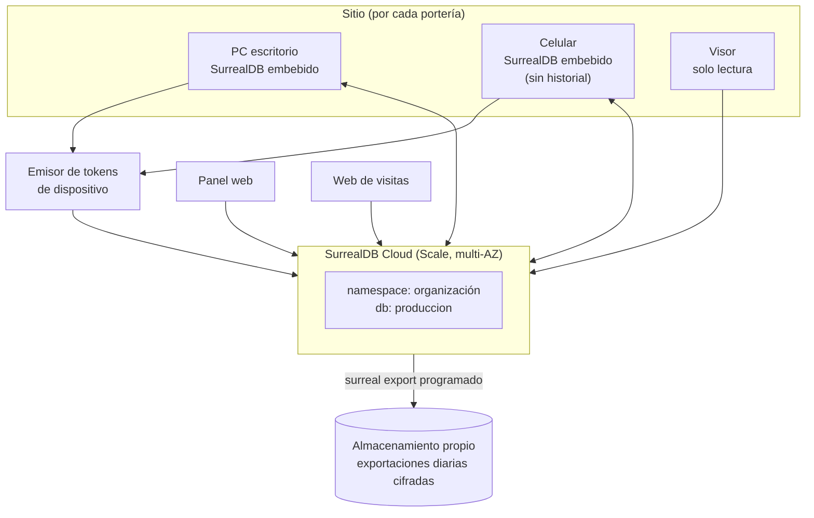

# Propuesta: rediseño total del núcleo con SurrealDB (embebido + nube)

Este documento no evalúa si la arquitectura actual está bien o mal. Plantea cómo
se construiría el núcleo desde cero, aprovechando lo que el sistema ya enseñó en
producción, y cómo encajaría SurrealDB en el dispositivo y en la nube de pago
(SurrealDB Cloud).

Estado: **propuesta para discusión**, sin implementar. Las cifras de precios y las
capacidades de SurrealDB se verificaron en octubre de 2026 contra la documentación
pública y deben confirmarse antes de cualquier compromiso (ver sección 11).

---

## 1. Qué aprendimos del sistema actual

Este rediseño parte de los problemas que el código y `docs/decisiones-tecnicas.md`
ya documentan:

| Síntoma observado | Causa de fondo |
| --- | --- |
| Dos esquemas que evolucionan en paralelo: 59 migraciones SQLite y 117 de Supabase | Dos motores y dos lenguajes (SQLite local y Postgres en la nube) para los mismos datos |
| La sincronización es el módulo más grande y frágil (`nube/sincronizacion/`, ~5.000 líneas solo de pruebas) | Se replican **filas mutables** con marcas de agua `updated_at`, traslapes de 5 minutos, reconciliación por diferencias de 7 días y lotes con plan B fila por fila |
| Errores sutiles de marca de agua (microsegundos, filas del mismo segundo) | El orden de los cambios depende del reloj y no de una secuencia que asigne el servidor |
| Ingresos activos duplicados entre sitios, detectados *después* de sincronizar | La invariante "una persona dentro a la vez" no tiene un dueño único, solo se comprueba por consulta |
| Política RLS restrictiva que hay que copiar a mano en cada tabla nueva | La autorización es por tabla y por convención, no por construcción |
| Dos modelos de identidad superpuestos (JWT de dispositivo propio y Supabase Auth) | Crecimiento incremental: dispositivo primero, humanos después |
| `AppCore` con una única conexión y candado; `con_nube` recibe un cierre para soltarlo antes de la red | Núcleo síncrono que también hace E/S de red |
| Guardas manuales contra retroceso del reloj del equipo | No hay reloj lógico, el orden se infiere de la hora de pared |

Lo que **sí** conviene conservar porque funciona bien:

- Reglas de negocio puras en un crate propio (`reglas/`), compiladas a WASM y
  compartidas con la web.
- Operación sin conexión en el punto de acceso.
- Identidad de dispositivo por par de claves (DPAPI/Android Keystore), sin
  secretos compartidos.
- Versionado de reglas grabado en cada movimiento (`VERSION_REGLAS_ACCESO`).

---

## 2. Principios del rediseño

1. **Los hechos no se editan, se agregan.** Cada operación del punto de acceso
   produce un *hecho* inmutable (`IngresoRegistrado`, `SalidaRegistrada`,
   `GafetePrestado`, ...). Las tablas que la UI consulta (Activos, Historial) son
   *proyecciones* que se reconstruyen a partir de los hechos. Replicar datos que
   solo se agregan es trivial; replicar filas que se editan es lo que hoy duele.
2. **Un solo esquema y un solo lenguaje de consulta** en el dispositivo y en la
   nube. Con SurrealDB embebido y en la nube, los mismos archivos `.surql`
   definen ambos lados.
3. **Toda invariante tiene un dueño explícito.** Para cada regla se decide si es
   *fuerte* (la garantiza la nube y, sin conexión, se acepta de forma provisional)
   o *local* (la garantiza el dispositivo). Nada queda "a ver si la consulta
   alcanza".
4. **El orden lo da una secuencia, no el reloj.** Reloj lógico híbrido (HLC) en
   cada dispositivo y *versionstamp* del servidor (changefeed) para leer cambios.
5. **La autorización se declara una vez por tabla y se evalúa en cada consulta**,
   incluidas las suscripciones en vivo.
6. **Arquitectura hexagonal (puertos y adaptadores).** El dominio y la aplicación
   no saben que existe SurrealDB; solo conocen *traits*. Eso permite pruebas
   deterministas y cambiar de motor sin reescribir reglas.
7. **Núcleo asíncrono con un único escritor local.** La red nunca se ejecuta
   bajo un candado de la base de datos.

---

## 3. Capas de responsabilidad



Qué hace cada capa y, sobre todo, qué **no** hace:

| Capa | Responsabilidad | Prohibido |
| --- | --- | --- |
| Presentación | Mostrar estado, capturar intención del usuario | Decidir si alguien entra; formatear reglas |
| Adaptadores de entrada | Traducir DTO a comando, error a mensaje | Lógica de negocio, acceso directo a la base |
| Aplicación | Orquestar: cargar estado, invocar al dominio, persistir hechos y proyecciones en una transacción | Reglas de negocio, SQL/SurrealQL en línea, E/S de red bajo candado |
| Dominio | Decidir y evolucionar el estado. Funciones puras y deterministas | Reloj del sistema, E/S, `async`, dependencias de infraestructura |
| Puertos | Contratos estables entre aplicación e infraestructura | Detalles de un motor concreto |
| Infraestructura | Implementar los puertos con SurrealDB, criptografía de plataforma y red | Reglas de negocio |
| Nube | Ser la autoridad de las invariantes fuertes, autorizar y difundir cambios | Lógica que el cliente no pueda reproducir (las reglas vienen del mismo crate) |

### Estructura de crates propuesta

```text
crates/
  dominio/          reglas puras + agregados + hechos (hoy: reglas/ + src/domain/)
  aplicacion/       comandos, consultas, puertos (traits), errores tipados
  almacen-surreal/  adaptador SurrealDB embebido y remoto
  replicacion/      motor push/pull, HLC, idempotencia
  identidad/        par de claves, aserción firmada, caché de token
  esquema/          *.surql versionados + ejecutor de migraciones
apps/
  escritorio/       Tauri (solo comandos y DTO)
  movil/            uniffi (solo fachada)
nube/
  esquema/          enlaza crates/esquema
  funciones/        fn:: y DEFINE API
  plugin-reglas/    crates/dominio compilado como extensión Surrealism (WASM)
```

La regla de dependencias es estricta: `dominio` no depende de nada del proyecto;
`aplicacion` depende solo de `dominio`; los adaptadores dependen de `aplicacion`;
las apps solo componen. Un `cargo deny` o una prueba de arquitectura lo hace
cumplir en CI.

---

## 4. Flujo de la app (operación en el punto de acceso)



Diferencia clave frente al flujo actual: la unicidad de "una persona dentro a la
vez" se **reserva** antes de registrar (cuando hay red) mediante un registro con ID
determinista. No se consulta y luego se escribe; la escritura misma falla si ya
existe. Sin red, el ingreso se acepta como provisional y la nube lo resuelve al
sincronizar (sección 6.3).

### Ciclo de vida de un ingreso



Cada transición es un hecho. El estado nunca se sobrescribe: se deriva.

---

## 5. Flujo de datos



### Secuencia de replicación



Por qué esto elimina la complejidad actual:

- **No hay marcas de agua por hora**: el versionstamp del changefeed es monótono y
  lo asigna el servidor. Desaparecen los traslapes de 5 minutos, la reconciliación
  de 7 días y el problema de las filas del mismo segundo.
- **No hay `upsert` de filas mutables**: los hechos se insertan una sola vez; un
  reintento con el mismo ID es inocuo. Se acaba el "plan B fila por fila".
- **No hay `PATCH` condicional de "primero en llegar gana"**: dos salidas de la
  misma persona son dos hechos; la proyección aplica la primera según el orden HLC
  y registra la segunda como duplicada para auditoría.
- **El aviso en vivo trae el hecho completo**: aplicarlo es la misma función
  `evolucionar` que se usa al arrancar. No existen dos caminos de escritura.

---

## 6. Por qué SurrealDB y cómo se integra en el modelo

### 6.1 Encaje con el dominio

El dominio de control de accesos es, en esencia, un **grafo con tiempo**:
personas que pertenecen a empresas, que cruzan sitios, que portan gafetes, que
visitan a anfitriones, que conducen vehículos de rutas. SurrealDB combina
documento, grafo y relacional en un solo motor, y eso se aprovecha así:

| Necesidad del sistema | Hoy | Con SurrealDB |
| --- | --- | --- |
| Mismo esquema en equipo y nube | SQLite + Postgres, dos historiales de migración | Los mismos `.surql` en el embebido y en Cloud |
| "Una persona dentro a la vez" en todos los sitios | Consulta remota previa + chequeo posterior | Registro con ID determinista `presencia:⟨persona⟩`: crearlo dos veces falla por construcción |
| Gafete prestado una sola vez por sitio | Índices y validaciones dispersas | `prestamo_activo:[sitio, numero]` (ID compuesto) |
| Relaciones persona-empresa-sitio-cita | Tablas puente y JOIN | Aristas tipadas (`RELATE`, `TYPE RELATION`) y recorridos `->` / `<-` |
| Integridad referencial | Claves foráneas SQLite, distintas en Postgres | `record<empresa>` con `REFERENCE ON DELETE REJECT` |
| Búsqueda por nombre insensible a acentos | FTS5 trigram + `LIKE` | `DEFINE ANALYZER` (ascii, lowercase, ngram) + índice de texto completo |
| Avisos en vivo | Realtime de Supabase + resincronización | `LIVE SELECT` con permisos aplicados |
| Leer cambios desde un punto | Marcas `updated_at` | `CHANGEFEED` + `SHOW CHANGES ... SINCE` |
| Auditoría de campos críticos | Triggers y tablas manuales | `DEFINE EVENT` declarativo |
| Estado derivado (cita vencida, PRAIND por vencer) | Calculado en cada consumidor | Campos calculados (`COMPUTED`) en el esquema |
| Reglas también en el servidor | Edge Functions + WASM del crate `reglas` | Extensión Surrealism con el mismo crate |
| Autorización por sitio | RLS + política restrictiva copiada a mano | `PERMISSIONS` por tabla evaluadas con `$auth` en cada consulta |

### 6.2 Esquema de ejemplo (SurrealQL 3.x)

> Sintaxis orientativa. Debe validarse contra la versión exacta que se adopte.

```surql
-- Identidad de dispositivo
DEFINE TABLE dispositivo SCHEMAFULL
  PERMISSIONS FOR select WHERE id = $auth.id FOR create, update, delete NONE;
DEFINE FIELD sitio       ON dispositivo TYPE record<sitio>;
DEFINE FIELD tipo        ON dispositivo TYPE 'pc' | 'movil' | 'visor';
DEFINE FIELD huella      ON dispositivo TYPE string;
DEFINE FIELD revocado_en ON dispositivo TYPE option<datetime>;

-- El emisor de tokens firma un JWT corto; SurrealDB lo verifica y
-- comprueba en cada sesión que el dispositivo siga vigente.
DEFINE ACCESS dispositivo ON DATABASE TYPE JWT
  ALGORITHM ES256 KEY "<clave pública del emisor>"
  AUTHENTICATE {
    IF $auth.revocado_en != NONE { THROW "Dispositivo revocado" };
    RETURN $auth;
  }
  DURATION FOR SESSION 1h;

-- Catálogo
DEFINE TABLE persona SCHEMAFULL
  PERMISSIONS
    FOR select WHERE $auth != NONE
    FOR create, update WHERE $auth.tipo != 'visor' AND $auth.revocado_en = NONE
    FOR delete NONE;
DEFINE FIELD cedula           ON persona TYPE string ASSERT fn::cedula_valida($value);
DEFINE FIELD nombre           ON persona TYPE string;
DEFINE FIELD empresa          ON persona TYPE record<empresa> REFERENCE ON DELETE REJECT;
DEFINE FIELD praind_vence     ON persona TYPE option<datetime>;
DEFINE FIELD praind_estado    ON persona COMPUTED fn::estado_praind(praind_vence, time::now());
DEFINE INDEX persona_cedula   ON persona FIELDS cedula UNIQUE;

DEFINE ANALYZER nombres TOKENIZERS blank FILTERS ascii, lowercase, ngram(3, 10);
DEFINE INDEX persona_busqueda ON persona FIELDS nombre FULLTEXT ANALYZER nombres BM25;

-- Hechos: append-only por permisos, no por disciplina
DEFINE TABLE hecho SCHEMAFULL CHANGEFEED 30d
  PERMISSIONS
    FOR select WHERE sitio = $auth.sitio
    FOR create WHERE sitio = $auth.sitio AND $auth.tipo != 'visor'
    FOR update, delete NONE;
DEFINE FIELD tipo           ON hecho TYPE string;
DEFINE FIELD sitio          ON hecho TYPE record<sitio>;
DEFINE FIELD dispositivo    ON hecho TYPE record<dispositivo> VALUE $auth.id READONLY;
DEFINE FIELD hlc            ON hecho TYPE string;
DEFINE FIELD version_reglas ON hecho TYPE int;
DEFINE FIELD datos          ON hecho TYPE object FLEXIBLE;
DEFINE FIELD recibido_en    ON hecho TYPE datetime VALUE time::now() READONLY;

-- Invariante fuerte: una sola presencia por persona en todo el sistema
DEFINE TABLE presencia SCHEMAFULL;   -- id = presencia:<id de persona>
DEFINE FIELD sitio    ON presencia TYPE record<sitio>;
DEFINE FIELD desde    ON presencia TYPE datetime;
DEFINE FIELD ingreso  ON presencia TYPE record<hecho>;

-- Relación de grafo para consultas de trazabilidad
DEFINE TABLE cruzo TYPE RELATION IN persona OUT sitio SCHEMAFULL;

-- Auditoría declarativa
DEFINE EVENT auditar_persona ON persona WHEN $event = "UPDATE"
  AND ($before.empresa != $after.empresa OR $before.praind_vence != $after.praind_vence)
  THEN (CREATE auditoria CONTENT {
    registro: $after.id, antes: $before, despues: $after,
    actor: $auth.id, en: time::now()
  });
```

Consultas que hoy cuestan y con este modelo son una línea:

```surql
-- ¿Quién de la empresa X está dentro ahora, en cualquier sitio?
SELECT <-pertenece<-persona[WHERE id IN (SELECT VALUE id FROM presencia)] FROM empresa:x;

-- Estado de una persona tal como estaba el día de su ingreso (consultas versionadas,
-- requieren SurrealKV en modo versionado; verificar disponibilidad en Cloud).
SELECT * FROM persona:abc VERSION d'2026-09-01T08:00:00Z';
```

### 6.3 Dónde vive cada invariante

| Invariante | Dueño | Sin conexión |
| --- | --- | --- |
| Reglas de acceso (PRAIND, empresa activa, veto) | Dominio, en el equipo **y** en la nube (mismo crate) | Se aplican igual con el catálogo local |
| Una presencia activa por persona en todo el sistema | Nube (`presencia:⟨persona⟩`) | Ingreso provisional; si choca, `ConflictoDetectado` para el supervisor |
| Gafete prestado una vez por sitio | Equipo del sitio, confirmado en la nube | Válido si el sitio tiene un solo equipo emisor; si hay varios, provisional |
| Hechos append-only | Nube (`PERMISSIONS FOR update, delete NONE`) | El adaptador local no expone `update` sobre `hecho` |
| Orden causal | HLC en el equipo, versionstamp en la nube | HLC sigue funcionando sin red y tolera retrocesos del reloj |

Esto reemplaza la detección *a posteriori* actual por una regla explícita y
probada: la nube es la autoridad cuando hay red; sin red, el sistema acepta y
deja constancia, nunca pierde datos y nunca bloquea al operador por falta de
conexión.

### 6.4 Identidad unificada



- Un solo motor de autorización para dispositivos y personas: `PERMISSIONS` con
  `$auth`. No hay política restrictiva que copiar a mano en cada tabla nueva; la
  plantilla de tabla del ejecutor de migraciones la exige y una prueba lo verifica.
- La vigencia del dispositivo se comprueba en `AUTHENTICATE` y, para la
  revocación inmediata, también dentro de los `PERMISSIONS` de escritura.
- El emisor de tokens se mantiene fuera de la base: verificar una firma contra
  la clave pública registrada por cada dispositivo es una tarea de criptografía que
  conviene dejar en Rust auditado y no en SurrealQL.
- Las sesiones humanas pueden seguir en Supabase Auth durante la transición
  (SurrealDB acepta JWT externos vía `TYPE JWT` con JWKS) y migrarse después a
  `TYPE RECORD` con Argon2 si se desea retirar Supabase por completo.

---

## 7. Qué exprimir de SurrealDB Cloud (servicio de pago)

| Capacidad | Uso concreto en control de accesos |
| --- | --- |
| **Instancia gestionada con respaldos automáticos** | Fin de la gestión manual de respaldos centrales; retención configurable por instancia |
| **Plan Scale: 3 nodos, varias zonas de disponibilidad** | El registro de ingresos no puede caerse por un nodo; la reserva de presencia necesita una autoridad disponible |
| **LIVE SELECT** | Tablero de ocupación por sitio en tiempo real, alertas de PRAIND por vencer de personas que están dentro, aviso inmediato de conflictos al supervisor |
| **CHANGEFEED** | Base del motor de replicación y de integraciones externas (nómina, SST, BI) sin tocar el núcleo |
| **DEFINE API** | Endpoints propios en la base: agendar cita desde la web de visitas, vinculación de equipos, exportaciones; reemplaza buena parte de las Edge Functions |
| **GraphQL estable con permisos** | El panel web consulta directamente con la misma autorización, sin backend intermedio |
| **Extensiones Surrealism (WASM)** | El crate `dominio` corre dentro de la base: la nube valida con exactamente las mismas reglas que el punto de acceso |
| **Espacios de nombres** | Un *namespace* por organización cliente si el producto se comercializa; *databases* `produccion`/`pruebas` dentro de cada uno |
| **Índices vectoriales (HNSW)** | Detección de personas duplicadas por nombres mal escritos; búsqueda difusa con OCR imperfecto |
| **Surrealist** | Consola de administración y depuración sin desarrollar pantallas internas |

### Costo de referencia

Con los precios publicados (verificar en la página oficial antes de presupuestar):

| Entorno | Plan | Cálculo | Aprox. mensual |
| --- | --- | --- | --- |
| Pruebas | Start, instancia mínima | 0,021 USD/h × 730 h | ~15 USD |
| Producción | Scale, 3 nodos | 0,192 USD/h × 3 × 730 h | ~420 USD |

La documentación indica que el plan Start es de un solo nodo (sin alta
disponibilidad) y que las instancias gratuitas no tienen respaldos automáticos.
Para producción de un sistema de seguridad física, Scale es el mínimo razonable;
si el presupuesto no alcanza, Start de pago con respaldos es viable **porque los
equipos siguen operando sin conexión**: una caída de la nube degrada a modo
provisional, no detiene el punto de acceso.

---

## 8. Despliegue



El respaldo propio no es opcional: la documentación de Cloud indica que los
respaldos gestionados no se pueden descargar. Para un sistema con datos de
identidad conviene tener una copia bajo control propio.

---

## 9. Riesgos y contrapartidas

| Riesgo | Impacto | Mitigación |
| --- | --- | --- |
| **No hay sincronización embebido-nube lista para usar.** La página comercial la sugiere, pero la guía técnica describe sincronización gestionada por la aplicación | Hay que construir el replicador | Con hechos append-only + changefeed el replicador es pequeño (push idempotente y pull por versionstamp). Es mucho menos código que el actual |
| **Cifrado en reposo del embebido.** Hoy se usa SQLite3MC (ChaCha20-Poly1305); SurrealKV/RocksDB no ofrecen un equivalente integrado conocido | Datos personales en disco | BitLocker/cifrado de Android obligatorio, cifrado de campos sensibles (cédula) en la capa de adaptador, y retención local mínima |
| **Madurez frente a Postgres.** Motor más joven; la serie 3.x cambió el núcleo | Errores del motor, cambios de sintaxis | Fijar versión exacta, pruebas de contrato del esquema en CI contra embebido y contra Cloud, actualizar con ventana controlada |
| **Sin marco de migraciones estándar** | Disciplina manual | Crate `esquema` con migraciones `.surql` numeradas, tabla `migracion_aplicada` y pruebas que aplican todas las migraciones desde cero |
| **Respaldos de Cloud no descargables** | Dependencia del proveedor | Exportación programada a almacenamiento propio y prueba periódica de restauración |
| **Tamaño del binario móvil** | APK más grande | Medir con `kv-surrealkv` solamente; el móvil no guarda historial |
| **Surrealism y versionado temporal son recientes** | Puede que no estén disponibles en el plan elegido | Diseñarlos como mejoras: si no están, las reglas se validan en el replicador de la nube y la auditoría usa hechos |

---

## 10. Plan de migración incremental (patrón estrangulador)

No se propone una reescritura "big bang". Cada fase se puede liberar sola:

1. **Fase 0: dominio y hechos.** Unificar `src/domain` y `reglas/` en
   `crates/dominio` con `decidir`/`evolucionar`. Definir el catálogo de hechos.
   Pruebas de propiedades (`proptest`) sobre las reglas. Sin cambios visibles.
2. **Fase 1: nube en paralelo.** Levantar SurrealDB Cloud (Start) con el esquema
   `.surql`. Un proceso traduce los cambios de Supabase a hechos y los inserta.
   Comparar proyecciones de ambos lados a diario.
3. **Fase 2: panel web sobre SurrealDB.** El panel lee de SurrealDB vía GraphQL y
   `LIVE`. Supabase sigue siendo la fuente de escritura.
4. **Fase 3: escritorio con SurrealDB embebido.** Nuevo adaptador detrás de los
   puertos; el escritorio escribe hechos y replica a SurrealDB Cloud. Un puente
   mantiene Supabase actualizado para los consumidores que aún no migraron.
5. **Fase 4: móvil y web de visitas.** Misma fachada uniffi, nuevo adaptador.
   `DEFINE API` reemplaza las Edge Functions de visitas.
6. **Fase 5: retiro de Supabase.** Pasar a Scale, migrar sesiones humanas si se
   decide, apagar puentes y Edge Functions.

### Estrategia de pruebas

- **Dominio:** pruebas de propiedades sobre `decidir` y `evolucionar`, sin E/S.
- **Replicación:** simulación determinista con varios equipos virtuales, red
  partida y relojes desfasados; se verifica que todas las proyecciones convergen.
- **Esquema:** cada migración se aplica desde cero contra SurrealDB embebido en CI;
  pruebas de permisos que intentan actuar como `visor`, como dispositivo revocado y
  como otro sitio.
- **Contrato nube-cliente:** las mismas pruebas de esquema se ejecutan contra una
  instancia Start de pruebas en un flujo programado.

---

## 11. Recomendación

Adoptar SurrealDB **en ambos extremos** (embebido y Cloud). El valor no está en
cambiar Postgres por otro motor, sino en tres cosas que solo se obtienen juntas:

1. Un único esquema y lenguaje para el equipo y la nube.
2. Changefeeds y `LIVE SELECT` como base de una replicación de hechos inmutables,
   que es el cambio que realmente vuelve robusto al sistema.
3. Permisos por tabla evaluados con `$auth` en cada consulta, también en vivo.

Usar SurrealDB solo en la nube y conservar SQLite local deja vivo el problema de
los dos esquemas y es la opción menos recomendable. Si el riesgo de madurez o el
cifrado en reposo resultan inaceptables tras una prueba de concepto, el diseño de
hechos y capas de este documento sigue siendo válido con SQLite3MC local y
Postgres en la nube: la mejora principal es el modelo de hechos, no el motor.

**Siguiente paso sugerido:** una prueba de concepto de dos semanas acotada al flujo
de ingreso y salida con dos equipos simulados y una instancia Start, midiendo
latencia del aviso en vivo, comportamiento sin conexión, tamaño del binario móvil y
resolución de conflictos de presencia.

### Fuentes consultadas (octubre de 2026)

- [SurrealDB 3.0](https://surrealdb.com/3.0) y [notas de versión](https://surrealdb.com/releases/3.0)
- [Anuncio de SurrealDB 3.0](https://surrealdb.com/blog/introducing-surrealdb-3-0--the-future-of-ai-agent-memory)
- [Endpoints personalizados (DEFINE API)](https://dev.to/surrealdb/custom-api-endpoints-streamlining-your-architecture-36oe)
- [Precios de SurrealDB Cloud](https://surrealdb.com/pricing.md)
- [Respaldos y recuperación en Cloud](https://surrealdb.com/docs/manage/cloud/backups-and-recovery.md)
- [Alta disponibilidad en Cloud](https://surrealdb.com/docs/manage/cloud/high-availability)
- [Caso de uso embebido y edge](https://surrealdb.com/use-cases/embedded-edge) y [solución embebida](https://surrealdb.com/solutions/embedded-and-edge)
- [Arquitectura de SurrealDB](https://surrealdb.com/docs/architecture.md)
